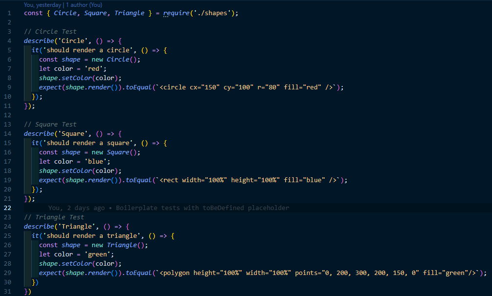

# From node.js to SVG
A simple program using node.js, inquirer, and jest to create an svg logo. 

I was able to get an html file and an svg file made, however, there is a bug in the code to render the svg itself. I plan to circle back to this challenge and find/fix the bug at a later date.

link to video: https://drive.google.com/file/d/1-Era_H-QIKYywGhUs-H_DPPXvYMOV88U/view

  ## Technologies Used

  Inquirer Package 8.2.4

  Jest Package 

  ## Credits
 * Walter Perry, TA for test suggestions

 * Class notes

 * MDN Basic Shapes: https://developer.mozilla.org/en-US/docs/Web/SVG/Tutorial/Basic_Shapes

 * MDN SVG Tutorial: https://developer.mozilla.org/en-US/docs/Web/SVG/Tutorial/Getting_Started

* [Example SVG](https://static.fullstack-bootcamp.com/fullstack-ground/module-10/circle.svg)

* [Scalable Vector Graphics (SVG)](https://en.wikipedia.org/wiki/Scalable_Vector_Graphics)

* [SVG tutorial](https://developer.mozilla.org/en-US/docs/Web/SVG/Tutorial)

* [Basic SVG shapes](https://developer.mozilla.org/en-US/docs/Web/SVG/Tutorial/Basic_Shapes)

* [Text in SVG](https://developer.mozilla.org/en-US/docs/Web/SVG/Tutorial/Texts)

* [SVG VS Code extension](https://marketplace.visualstudio.com/items?itemName=jock.svg)

 * https://www.youtube.com/watch?v=GJYMcLus3v0

## License

This project is licensed under the MIT license.